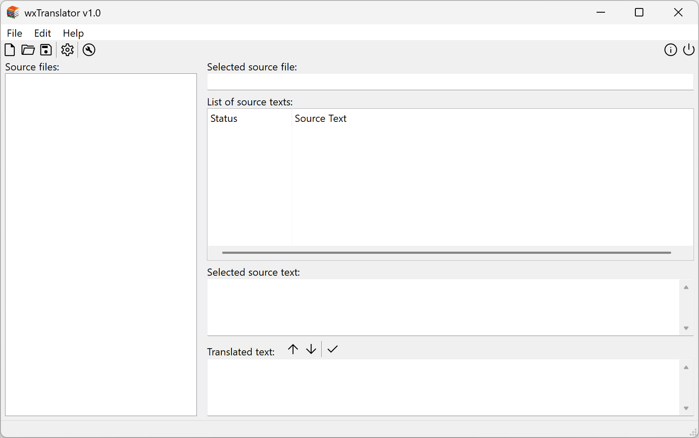
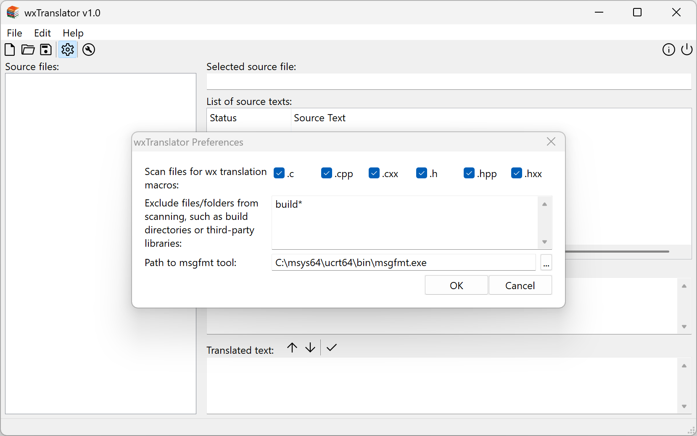
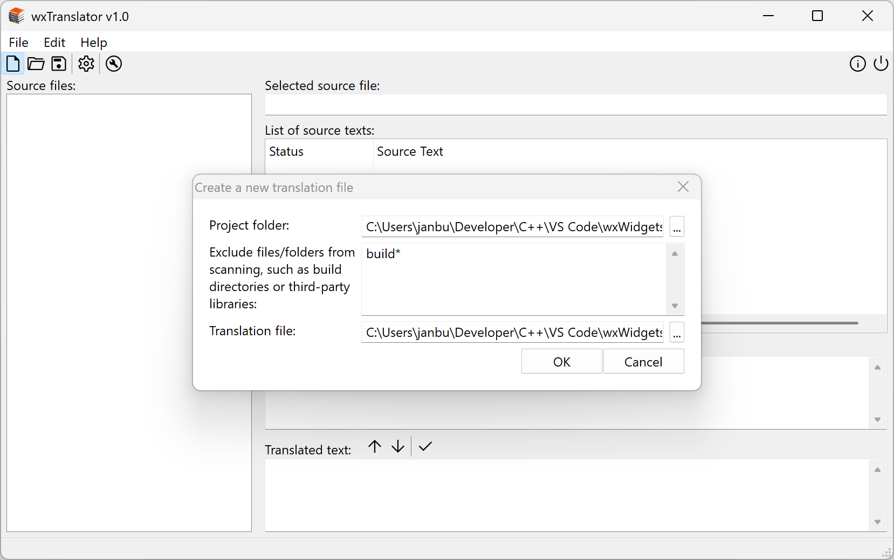
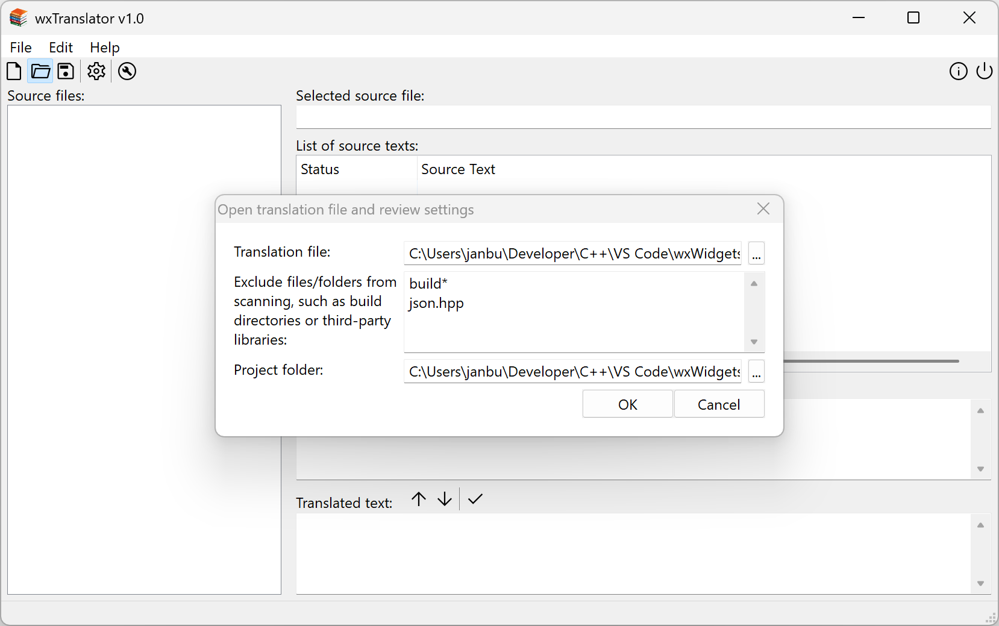
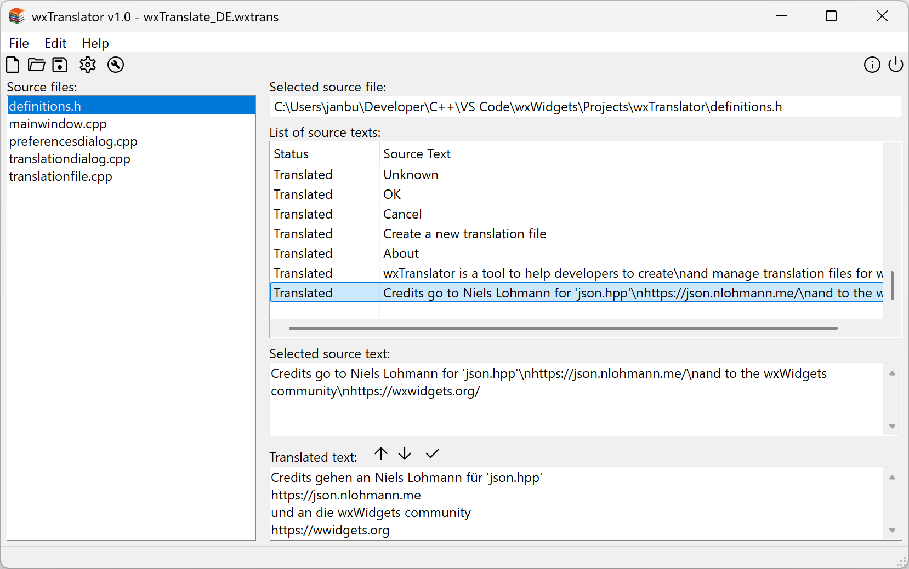
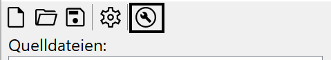
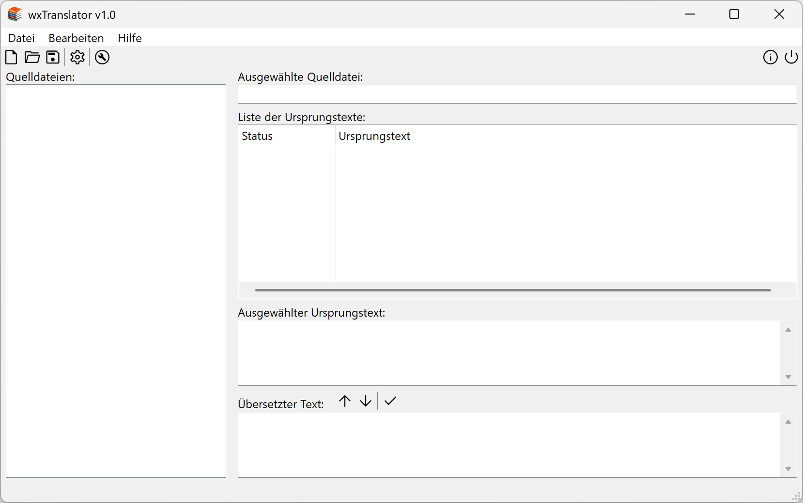

**wxTranslator (w) 2025 by Jan Buchholz**

wxTranslator is a tool that helps developers create and manage translation files for wxWidgets applications by extracting source text from wxWidgets translation macros.

### Application Start

### Application Preferences

- Select C++ file extensions to scan
- Choose files/folders to exclude from scanning
- Specify the path to the `msgfmt` utility

### Create a New Translation File

- Select the project folder
- Choose files/folders to exclude from scanning for the current project
- Provide the name and location of the translation file

### Open an Existing Translation File

- Adjust settings if necessary

### Translation File Loaded

- Select the source file using the list view on the left
- Select the text to be translated using the list view on the right
- Enter the translated text and commit changes
- Tool buttons (from left to right):
  - Move to previous text
  - Move to next text
  - Commit changes & automagically move to the next text

Don't forget to save the translation file when you're done.  
Click the highlighted toolbar icon to generate the final `.MO` file:  

This will first create the corresponding `.PO` file and then call the `msgfmt` tool to generate the final `.MO` file.

wxTranslator was used to generate its German translation:  

### Credits
- Niels Lohmann for [json.hpp](https://json.nlohmann.me/)
- The people who created and maintain [wxWidgets](https://wxwidgets.org/)
- Microsoft Copilot, which was an indispensable help during my very first delve into wxWidgets

### Updates
2025-11-13:
Added presets for Windows arm64 and msys2 clangarm64 toolchain to CMakePresets.json. Obviously there's no reliable method to detect the processor architecture in CMake at the moment. Tried a quirky workaround using [PROCESSOR_IDENTIFIER], which works at least on my machines.

